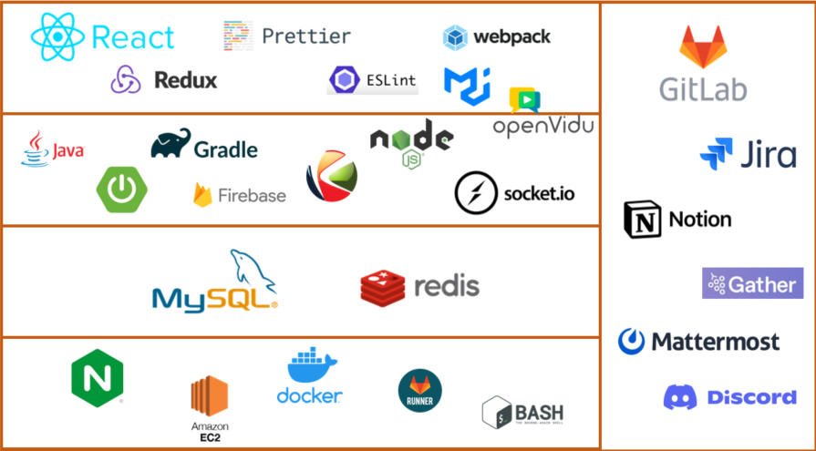
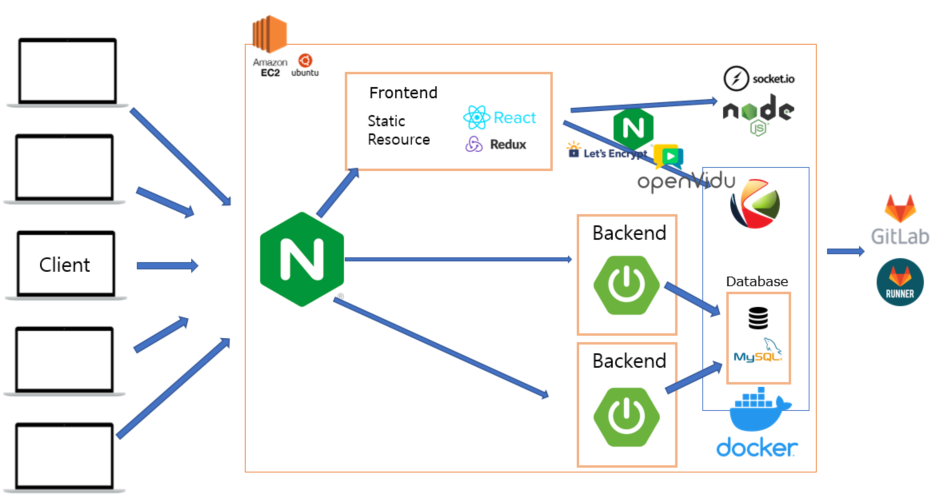
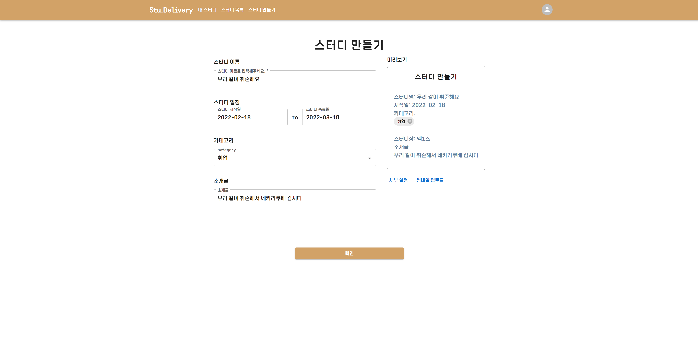
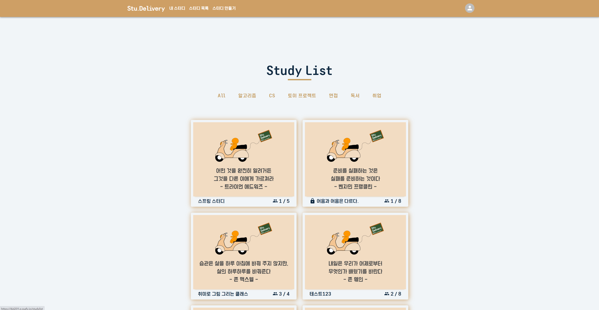
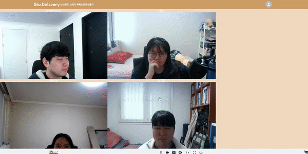

# 📙서비스 소개

❓ 공부할 건 산더미인데 혼자서는 잘 안되시나요?

❓ 스터디 그룹을 형성하고 싶은데 어디서부터 해야할 지 고민이신가요?

❓ 스터디를 효과적으로 진행하고 싶으신가요?

**스터디카페**를 언제 어디든 배달해주는 [**스터딜리버리**](https://i6d201.p.ssafy.io/)에서 해결하세요!

함께 하고 싶은 팀원을 모집하고 화상으로 마주하며 일정, 코드 등을 자유롭게 공유할 수 있는 서비스입니다.

[서비스 체험하러 가기](https://i6d201.p.ssafy.io/)

# 🛠 Tech stack

# 🌟 팀 소개

| 김길웅 (팀장) | 김민정   | 나요셉          | 박준용           | 윤혜윤   |
| ------------- | -------- | --------------- | ---------------- | -------- |
| Backend       | Frontend | Backend & infra | Frontend & infra | Frontend |

## 📷 와이어프레임

## ✨ 주요 기능

### 로그인

### 

- 아이디와 비밀번호를 입력하여 로그인 할 수 있습니다.
- 또한 Google, GitHub 계정을 통한 소셜 로그인을 이용할 수 있습니다.

### 대시보드

- 마이페이지/대시보드 화면에서 나의 관심사를 확인할 수 있습니다.

* 추가하기 버튼을 클릭하여 목표를 추가할 수 있습니다.

### 스터디 만들기

- 스터디 이름, 시작일/종료일, 참가 인원, 소개글, 썸네일을 설정하여 스터디를 생성할 수 있습니다.

### 스터디 목록

- 스터디 목록 탭에서 현재 만들어진 스터디를 확인할 수 있습니다.
- 관심사 카테고리별로 스터디 목록을 확인할 수 있습니다.
- 내 스터디 탭에서 내가 가입한 스터디를 확인할 수 있습니다.

### 스터디 라운지

- 첫 화면에서 스터디 멤버의 닉네임, 관심사를 확인할 수 있습니다.
- 스터디 라운지를 클릭하여 스터디 그룹의 대시보드, 공유 일정을 확인할 수 있습니다.
- 스터디 라운지에서 대시보드에 메모를 추가할 수 있고, 캘린더에 일정을 자유롭게 공유할 수 있습니다.

### 회의실

- 회의실에 입장하여 멤버들과 그룹 스터디를 진행할 수 있습니다.
- 텍스트 에디터 버튼을 클릭하여 코드 공유 기능을 이용할 수 있습니다.

### 개인 열람실

- 개인 열람실에서는 본인의 공부 시간을 체크할 수 있습니다.

# 🌸 More Info

[:notebook: 노션 문서](https://www.notion.so/dev-junyong/Stu-Delivery-60d474a778374b48a3aba5a99737cff0) 
